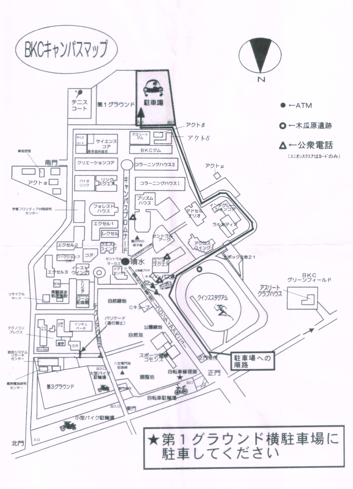
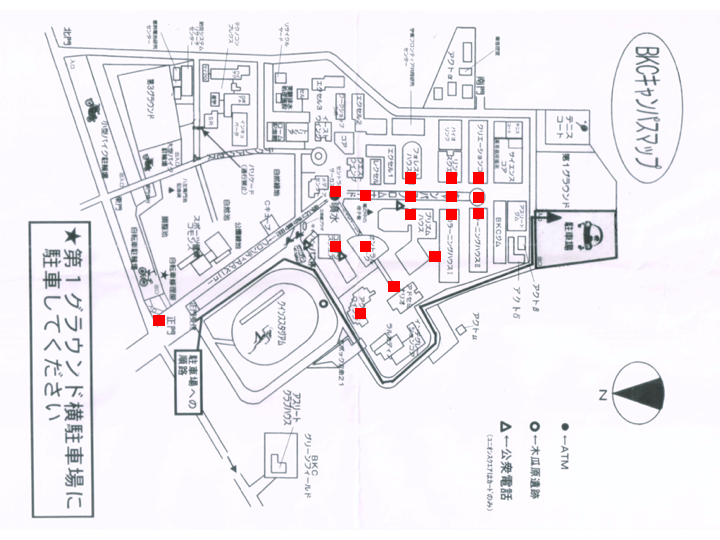
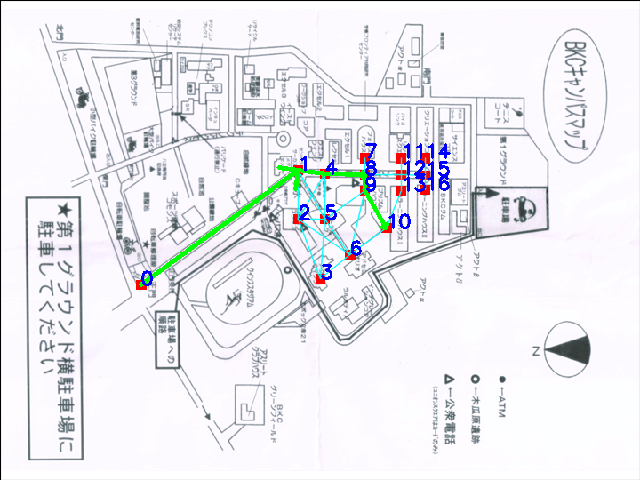

# Ritsumeikan-Dijkstra

立命館大学の広大な土地で迷わないよう，さらに授業間の教室移動が間に合うように，建物間の最短経路を求めるプログラムを書きました．
プログラムの手順は

1. マップ上の重要なポイントに赤いマークをして，
2. その座標を取得し，
3. 座標を圧縮し，
4. 座標間の距離を求め，
5. ダイクストラ法で経路を生成する．そして，
6. 入力された頂点間に対して最短経路を図示します

**元の画像**

**頂点に色をつけた画像**

**プログラムによって生成された画像(頂点0から頂点10の場合)**

## 使い方

1. 赤く点を塗った写真をPictureフォルダ内に「plot.png」という名前で入れてください
2. [edge.csv](./edge.csv)に道路(辺)を記入してください．辺は「どこから，どこまで」を２行で書き，次の辺はカンマ区切りでその隣に書いてください．また，「どこから，どこまで」を書くと逆側の辺も自動で貼られます
3. [dijkstra.cpp](./dijkstra.cpp)を実行してください
4. [interface.py](./interface.py)を実行し，計算させた経路の頂点番号を記入してください．頂点番号は[interface.py](./interface.py)または[writeplot.py](./writeplot.py)で確認できます．

## ファイルの説明

### div_color.py

### showpixel.py

### writeplot.py

### zip.cpp

### pixel.csv

### Pictures/plot.JPG

### Pictures/rgbsample.png

### Pictures/plot.png
